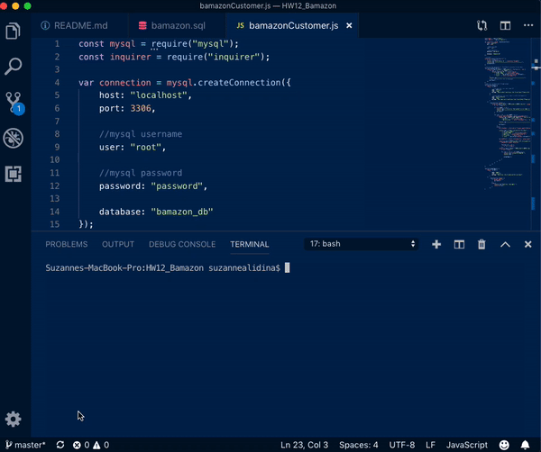

# HW12_Bamazon
Homework #12 Bamazon Project

## Bamazon Project ##
### About ###
This app runs similar to another existing website, Amazon. THe app takes in orders from customers and depletes the stock from the store's inventory.

### Before We Start ###
You will need to run npm install to get the right packages from the package.json otherwise this program will not work.

### How It Works ###
When you run the app it will show you a pre-loaded list of Products, their Item IDs, and their Prices. You then be prompted with two questions, "What product would you like to buy?" The customer will enter the Item ID and then be prompted with the second question "How many units would you like to purchase?" The customer will then enter in a number.

The program will prompt the user if they enter in a number greater than the units that they have available and will prevent the order from going through.

If the store has enough units the customer's ordered is fufilled and will let the customer know how much the total cost of their purchase was. The databse is updated to reflect the remaining quantity.

### The Demonstration ###
